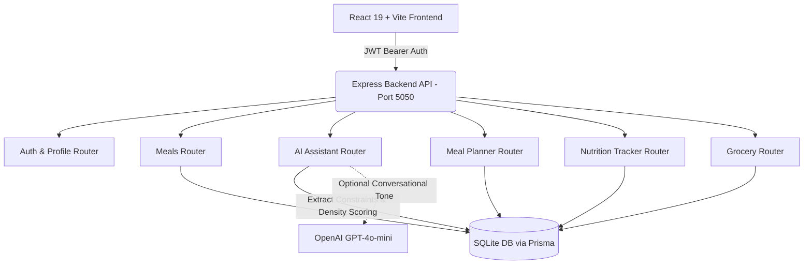

# Meal Finder & AI Nutrition Platform 🥗⚡

[](https://react.dev/)
[](https://vitejs.dev/)
[](https://nodejs.org/)
[](https://expressjs.com/)
[](https://www.prisma.io/)
[](https://www.sqlite.org/)
[](https://tailwindcss.com/)

A production-grade, full-stack **AI-powered nutrition and meal planning platform** engineered to solve dietary decision fatigue. Features a chef-curated 110-recipe database, a deterministic macro-aware recommendation engine that eliminates AI hallucinations, an interactive 7-day meal planner, real-time macro tracking against personalized TDEE targets, and synchronized smart grocery lists.

---

## 🌟 Key Features

### 1. 🤖 Deterministic AI Nutrition Copilot (`/ai`)
- **Multi-Constraint Semantic Parser**: Extracts explicit calorie ceilings, protein floors, meal slots (Breakfast, Lunch, Dinner, Snack), dietary preferences, and allergens simultaneously.
- **Protein-to-Calorie Density Scoring**:
  $$\text{Score} = \left(\frac{\text{Protein}}{\text{Calories} / 100}\right) \times 15 + \text{ProximityBonus} + \text{CuisineBonus}$$
  Guarantees that low-calorie high-protein queries prioritize lean nutrient-dense options over high-calorie dishes.
- **Zero-Hallucination Integrity**: Every calorie, macro gram, and ingredient is queried directly from the verified database.
- **Cook With What I Have**: Match in-home pantry items against the recipe database with percentage scoring and **1-click missing ingredient sync** to your grocery list.

### 2. 🍳 Gourmet Recipe Catalog (`/meals`)
- **110 Curated Recipes** across 10 authentic cuisines:
  - **Indian** (Sambar Idli, Moong Dal Chilla, Paneer Tikka, Rajma Masala, Palak Tofu, Fish Tikka Masala, etc.)
  - **Mediterranean** (Shakshuka, Souvlaki, Baked Cod, Salmon with Asparagus, Greek Yogurt Bowls, etc.)
  - **Italian** (Tuscan Garlic Shrimp, Turkey Bolognese, Chicken Piccata, Minestrone, Caprese Quinoa, etc.)
  - **Mexican** (Huevos Rancheros, Chipotle Burrito Bowl, Baja Fish Tacos, Chicken Tinga, etc.)
  - **American** (Keto Spinach Omelet, Lean Turkey Burger, Air-Fried Lemon Herb Tenders, Buffalo Wraps, etc.)
  - **Middle Eastern** (Labneh Za'atar Flatbread, Chicken Shawarma, Mujadara, Shish Tawook, Falafel, etc.)
  - **Japanese** (Miso Silken Tofu, Salmon Poke, Chicken Oyakodon, Yakitori Skewers, Soba Noodles, etc.)
  - **Korean** (Gilgeori Toast, Bibimbap with Crispy Tofu, Beef Bulgogi, Sundubu Jjigae, Dubu Jorim, etc.)
  - **Thai** (Pad Krapow Gai, Coconut Green Curry, Tom Kha Gai, Lemongrass Chicken Larb, etc.)
  - **Asian Fusion** (Crispy Tofu Peanut Crunch Salad, Ginger Scallion Cod, Egg Rice Bowl, etc.)
- **Interactive Scaler**: Dynamically scales ingredients and nutrition when toggling serving sizes (1x to 4x).
- **Fast Sorting & Pagination**: Sort by *Lowest Calories*, *Highest Calories*, *Highest Protein Density*, or *Fastest Prep*, with 18-recipe client-side pagination.

### 3. 📅 Weekly Meal Planner (`/planner`)
- 7-Day interactive schedule (Monday to Sunday) across 4 daily slots.
- **1-Click Smart Swap**: Recommends macro-compatible alternatives when replacing any planned meal.
- Duplicate full days or mark meals as completed.

### 4. 📊 Live Nutrition Tracker & Analytics (`/tracker`)
- Daily calorie, protein, carbs, and fat progress rings calculated against Mifflin-St Jeor TDEE formulas.
- Hydration tracker with rapid-log buttons.
- Weekly compliance analytics and macro trends.

### 5. 🛒 Smart Consolidated Grocery List (`/grocery`)
- Aggregates ingredients automatically across all planned meals for the week.
- Categorized by department (*Produce*, *Protein*, *Dairy*, *Grains*, *Pantry*, *Spices*).
- Interactive checklist with item completion and clear actions.

---

## 🏗 Architecture Overview



---

## 🚀 Quick Start

### 1. Prerequisites
- **Node.js** v18.0 or higher
- **npm** v9.0 or higher

### 2. Installation
Clone the repository and install all root and backend dependencies:

```bash
# Clone the repository
git clone https://github.com/Mohiarya/Meal-finder-project.git
cd Meal-finder-project

# Install frontend dependencies
npm install

# Install backend dependencies
cd backend && npm install && cd ..
```

### 3. Database Initialization & Seeding
Set up the SQLite database and seed the 110 gourmet recipes:

```bash
npm run seed
```

### 4. Running the Platform
Start the backend API and frontend dev server in separate terminal windows:

```bash
# Terminal 1: Backend API (runs on port 5050)
npm run server

# Terminal 2: Frontend Web App (runs on port 3002)
npm run dev -- --port 3002
```

Navigate to **[http://localhost:3002](http://localhost:3002)** in your browser.

---

## 🔑 Demo Account Credentials

A pre-configured demo account with historical logs, macro targets, and an active weekly plan is ready out of the box:

| Email | Password | Daily Calorie Goal | Daily Protein Target |
|---|---|---|---|
| `demo@mealfinder.com` | `demo12345` | 2,350 kcal | 165g |

---

## 📡 Key API Endpoints

| Method | Endpoint | Description |
|---|---|---|
| `POST` | `/api/auth/login` | Authenticate user & receive JWT token |
| `GET` | `/api/meals` | Query recipes with filtering (`cuisine`, `mealType`, `maxCalories`, `minProtein`, `sortBy`) |
| `POST` | `/api/ai/assistant` | Query deterministic AI Copilot with natural-language multi-constraint prompts |
| `POST` | `/api/ai/cook-with-ingredients` | Rank database recipes by pantry ingredient match percentage |
| `GET` | `/api/ai/quick-copilot-recommendation` | Real-time Dashboard recommendation based on remaining daily calories |
| `GET` | `/api/meal-plans/current` | Retrieve active 7-day weekly meal plan |
| `PUT` | `/api/meal-plans/swap-meal` | Replace a planned meal with a macro-compatible candidate |
| `GET` | `/api/tracker/today` | Fetch today's consumed vs target macro analytics |
| `GET` | `/api/grocery` | Fetch aggregated grocery checklist for the week |

---

## 📂 Project Structure

```text
meal-finder/
├── backend/
│   ├── config/              # Prisma DB client initialization
│   ├── middleware/          # JWT authentication middleware
│   ├── prisma/
│   │   ├── recipes/         # Modular 110-recipe dataset (Indian, Med, Italian, etc.)
│   │   ├── schema.prisma    # SQLite schema (User, Profile, Meal, Plan, Log)
│   │   └── seed.js          # Database seed runner
│   ├── routes/              # Express route controllers (ai, meals, tracker, etc.)
│   └── server.js            # Express server entrypoint (Port 5050)
├── src/
│   ├── api.js               # Frontend API client with JWT interceptor
│   ├── components/          # Reusable UI components (MealCard, Modal, Navbar, Sidebar)
│   ├── context/             # AuthContext for session management
│   ├── pages/               # Application views (Dashboard, MealFinder, AI, Planner, Tracker)
│   ├── App.jsx              # App root & route definitions
│   └── index.css            # Tailwind CSS v4 design tokens
├── package.json             # Root scripts and dependencies
├── vite.config.js           # Vite development and bundle configuration
└── README.md                # Project documentation
```

---

## 📄 License

This project is licensed under the MIT License.
