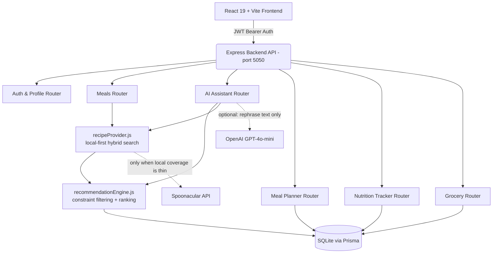

# Meal Finder AI

[](https://react.dev/)
[](https://vitejs.dev/)
[](https://nodejs.org/)
[](https://expressjs.com/)
[](https://www.prisma.io/)
[](https://www.sqlite.org/)
[](https://tailwindcss.com/)

A full-stack nutrition and meal-planning app: a 110-recipe curated database backed by an optional external recipe provider for dish-name searches the local catalog doesn't cover, a **deterministic** (non-LLM) recommendation engine that enforces hard nutritional and dietary constraints instead of trusting an AI model to get them right, a 7-day meal planner, daily macro/hydration tracking against personalized TDEE targets, and a grocery list auto-generated from the planned week.

This is a dynamically expandable recipe catalog, not an unlimited one — see [External Recipe Search](#external-recipe-search) for exactly what that means and what it costs.

An optional OpenAI key can be added to rephrase the engine's already-computed recommendation in a more conversational tone — the app is fully functional, and every number it shows is database-verified, without that key.

---

## Key Features

### 1. Deterministic AI Nutrition Copilot (`/ai`)
- **Multi-constraint parsing**: extracts calorie ceilings, protein floors, meal slot, diet, cuisine, prep time, and allergens from a natural-language prompt, and always layers in the user's persistent profile (allergies, dislikes, diet) even when the prompt doesn't mention them.
- **Hard constraints, not suggestions**: allergens and diet restrictions are filtered *before* any ranking happens — a result can never violate them, even under fallback relaxation (which only ever loosens cuisine/calorie/protein *closeness*, never diet or allergens).
- **Protein-density ranking**: candidates are scored primarily on protein-per-100kcal so a low-calorie/high-protein request can't surface a high-calorie dish.
- **Every number comes from the database.** The AI layer (when an OpenAI key is configured) only rephrases the headline/reason text for an already-selected meal — it cannot invent a recipe, a calorie count, or a macro.
- **Cook With What I Have**: matches pantry ingredients against the recipe database with a percentage score and pushes missing ingredients to the grocery list in one click.

### 2. Recipe Catalog (`/meals`)
- 110 curated recipes spanning 10 cuisines (Indian, Mediterranean, Italian, Mexican, American, Middle Eastern, Japanese, Korean, Thai, Asian Fusion), each with full macros, ingredients, and step-by-step instructions.
- A search for a dish the local catalog doesn't have (e.g. "chicken biryani", "chocolate cake") that returns too few local matches falls through to an external recipe provider automatically — see [External Recipe Search](#external-recipe-search).
- Serving-size scaler that recalculates macros and ingredient quantities live.
- Sort by calories, protein density, or prep time; search and meal-slot filtering.

### 3. Weekly Meal Planner (`/planner`)
- A 7-day × 4-slot grid. Smart Swap suggests macro-comparable alternatives for any planned meal. Duplicate a day's plan to another day; mark meals eaten to log them automatically.

### 4. Nutrition Tracker & Analytics (`/tracker`)
- Daily calorie/protein/carb/fat progress against Mifflin-St Jeor-derived targets, hydration logging, and a 7-day trend view.

### 5. Grocery List (`/grocery`)
- Auto-consolidated from every meal in the current week's plan, grouped by category, with a shopping checklist.

---

## Architecture



The AI Assistant chat and the Dashboard's unprompted "what's next" suggestion both go through the same `recommendationEngine.js` — constraint extraction, hard filtering, and fallback relaxation are shared, so a bug fixed in one path can't silently persist in the other. Only the final ranking strategy differs by design: the assistant ranks by relevance to the prompt, the dashboard ranks by closeness to the user's remaining calorie/protein budget. The Dashboard copilot deliberately stays local-only (no external fallback) — an unprompted suggestion should come from the catalog, not a live web search.

---

## External Recipe Search

The local 110-recipe catalog is hand-curated and won't have every dish someone might search for. `backend/services/recipeProvider.js` adds a **local-first hybrid search**: it only calls an external API when the local catalog genuinely falls short, and external results are put through the *exact same* hard-constraint gate (`matchesHardConstraints` from `recommendationEngine.js`) as local ones — the recommendation engine has no idea, and doesn't need to know, whether a given recipe came from SQLite or the network.

### Why Spoonacular, not Edamam

Both were evaluated against this project's actual requirements (nutrition data, cuisine coverage including Indian food, a usable free tier, clear caching rules) before picking either:

| | Spoonacular | Edamam (Recipe Search API) |
|---|---|---|
| Free tier | Yes — 50 points/day, no credit card | **None.** Cheapest tier is $9/month (Basic) |
| Cooking instructions | Included on the free tier | Only on the $399/month+ "Plus" tier (own-content only, ~20K recipes); the affordable web-recipe tiers link out instead of returning instructions |
| Cuisine coverage | Includes Indian, Chinese, Japanese, Korean, Thai, Mexican, Middle Eastern, etc., plus a `dessert` dish type | Broad, but the instructions gap above matters more for this app |
| Caching | Explicitly allowed, up to 1 hour | Restricted to "presentation to the end user" only, with active-subscription requirements even for permitted caching |

Edamam's Recipe Search API having no free tier at all was the deciding factor for a portfolio project — Spoonacular's free tier, its included instructions, and its explicit (if short) caching allowance fit this app's needs and budget far better.

### How the hybrid search actually works

1. A request (an AI Assistant prompt, or a Meal Finder search) is parsed into structured constraints (calories, protein, diet, cuisine, meal slot, allergens) exactly as before — nothing about constraint extraction changed.
2. The local catalog is searched first. For a natural-language AI prompt with real constraint signal ("under 400 calories"), that signal *is* the search. For a bare dish-name search ("chicken biryani") with no such signal, local relevance is judged by whether the query's words actually appear in a recipe's title/description/ingredients — otherwise an empty constraint set would trivially "match" all 110 recipes and say nothing (this was a real bug caught during testing: "cake recipe" first returned an unrelated steak dinner, and after a naive first fix, matched "pancakes" on the substring "cake" inside "pancakes" before a word-boundary fix corrected it).
3. Only if local coverage is thin (below a small threshold) does it call Spoonacular, with the same constraints mapped onto Spoonacular's own filters (`cuisine`, `diet`, `maxCalories`, `minProtein`, `intolerances`, `type`).
4. Every external result is normalized into the exact same shape a local Prisma row has, validated (calories/protein/carbs/fat/image must all be present as real numbers — a recipe with missing nutrition is rejected outright, never treated as "0 kcal" or silently allowed to satisfy a limit), and then filtered through `matchesHardConstraints` again — allergens and diet are enforced a second time locally rather than trusted from the provider's own tags alone.
5. Local and external results are combined and de-duplicated by title. If nothing valid is found anywhere, the response is an honest "no match" — never a fabricated or unrelated recipe presented as a fit.

### What external recipes can't do

An external recipe has a synthetic id (`ext-spoonacular-<id>`), not a row in the local `Meal` table, so **favoriting, meal-planning, and tracker-logging aren't available for it** (those require a real foreign key) — its card only offers "View Recipe" and a link back to the original source. This is a deliberate scope boundary, not an oversight: persisting external results into the local database to support those actions would mean permanently storing third-party content, which Spoonacular's terms don't clearly permit and which this project was explicitly asked not to do.

### Cost, quota, and licensing

- **Free tier**: 50 points/day, no credit card, via a direct spoonacular.com signup (not the RapidAPI marketplace, which does require a card for overages this app is designed to never incur).
- **Internal safety margin**: `recipeProvider.js` tracks an estimated points budget (35/day, reset daily) independently of Spoonacular's own 50/day limit, so the app degrades to local-only *before* the real quota is hit rather than after.
- **Caching**: capped at 1 hour in-memory (`recipeProvider.js`'s own cache), matching Spoonacular's terms exactly — external results are never written to SQLite or otherwise persisted longer than that.
- **Attribution**: every external recipe links back to its original source (`sourceUrl`), shown on its card and detail view, satisfying Spoonacular's attribution requirement on the free tier.
- **Fully optional**: with no `RECIPE_API_KEY` set, `recipeProvider.js` skips external calls entirely and the app runs exactly as it did before this feature existed — local-only, no error, no degraded UX beyond not finding a dish outside the 110.

---

## Quick Start

### 1. Prerequisites
- Node.js v18+ and npm v9+

### 2. Install

This repo has **two independent npm projects** — the root (frontend) and `backend/` — each with its own `package.json` and `node_modules`. Install both:

```bash
git clone https://github.com/Mohiarya/Meal-finder-project.git
cd Meal-finder-project

npm install
cd backend && npm install && cd ..
```

### 3. Configure environment variables

Copy the two `.env.example` files and fill them in:

```bash
cp .env.example .env
cp backend/.env.example backend/.env
```

`backend/.env` needs a real `JWT_SECRET` — the server refuses to start without one. Generate one with:

```bash
node -e "console.log(require('crypto').randomBytes(48).toString('hex'))"
```

`OPENAI_API_KEY` and `RECIPE_API_KEY` are both optional (see [AI Configuration](#ai-configuration) and [External Recipe Search](#external-recipe-search)) — the app is fully functional on the local catalog and the deterministic engine alone without either. The frontend's `.env` (`VITE_API_URL`) can stay empty for local development — it falls back to `http://localhost:5050/api`.

### 4. Initialize and seed the database

```bash
npm run seed
```

This creates `backend/prisma/dev.db`, seeds the 110 recipes, and creates a demo account (see below).

### 5. Run it

In two terminals:

```bash
# Terminal 1 — backend API on port 5050
npm run server

# Terminal 2 — frontend on port 5173
npm run dev
```

Open **http://localhost:5173**. (If you run the frontend on a different port, add it to `backend/app.js`'s CORS allowlist or set `CLIENT_ORIGIN` in `backend/.env`.)

### 6. Run the tests

```bash
npm run test              # frontend — Vitest
cd backend && npm run test  # backend — node:test
```

---

## Demo Account

```
Email:    demo@mealfinder.com
Password: demo12345
```

Seeded with a sample profile, macro targets, and weekly plan so the app is immediately explorable without registering. The login page also has a one-click "Demo Login" button.

---

## AI Configuration

`OPENAI_API_KEY` in `backend/.env` is optional. Without it, the AI Assistant still works end-to-end — headline and reason text are generated deterministically from the same data the recommendation is built from. With a key set, that text is passed through GPT-4o-mini to be rephrased more conversationally; the model receives the already-selected meal's real data and is not permitted to change the calories, macros, or ingredients, and its output is validated (length and shape) before being shown — a malformed or empty AI response silently falls back to the deterministic text rather than breaking the page.

---

## Testing

- **Backend** (`backend/**/*.test.js`, run via `node --test`): unit tests for the recommendation engine's constraint extraction, hard-constraint filtering, fallback relaxation, and ranking; unit tests for the nutrition-target calculator (BMR/TDEE/macro-split math, including edge cases like the weight-loss calorie floor and malformed profile input); unit tests for the hybrid recipe provider (local-sufficient vs. external-fallback branching, external recipe normalization, the nutrition-safety validation gate, missing/invalid nutrition data, calorie/protein/diet/allergen/cuisine/meal-type filtering applied identically to external results, API failure/timeout/missing-key/quota-exceeded handling, local+external de-duplication, and the "no fabricated recipe" no-match behavior — all against a mocked `fetch`, no real API calls); integration tests against the real Express app covering auth, and — the most security-relevant tests in the suite — that one user genuinely cannot read, modify, or delete another user's meal plans, tracker logs, favorites, or grocery items (verified both by HTTP status and by querying the database directly afterward).
- **Frontend** (`src/**/*.test.jsx`, run via Vitest): covers `ProtectedRoute`'s auth-gating behavior (loading state, redirect when logged out, render when logged in).

Coverage is intentionally scoped to logic where a bug would be silent and high-impact (constraint violations, cross-user data access, macro math) rather than chasing a coverage percentage.

---

## Security Notes

- Passwords are hashed with bcrypt; sessions are JWTs sent as a `Bearer` token (not cookies).
- Every meal-plan/tracker/favorite/grocery mutation verifies the resource belongs to the authenticated user before touching it, rather than trusting a client-supplied ID.
- CORS is an explicit allowlist (`localhost:3002`, `localhost:5173`, and `CLIENT_ORIGIN` in production) — not `origin: "*"` — since the JWT is bearer-token-based and an open CORS policy would let any origin holding a copy of a token replay it.
- Auth and AI endpoints are rate-limited (20 requests / 10 minutes) against brute-force and cost abuse.
- Unhandled server errors return a generic message; only CORS rejections get a specific one. Internal error details are never sent to the client.

---

## Known Limitations

Being direct about what this project is and isn't, per the philosophy above:

- **Recipe photography**: 110 recipes draw from 38 unique Unsplash images, so most photos are shared across more than one recipe. Three recipes that had a genuinely mismatched or dead image were fixed and manually verified; the remaining sharing is a real gap that would need either commissioned/licensed photography or a larger stock-photo budget to close properly, not a quick fix.
- **In-memory filtering**: the recommendation engine and meal query endpoints filter/sort the recipe set in application memory rather than in SQL. At 110 recipes this is fast and simpler to reason about; it is not the approach that would be chosen for a catalog in the tens of thousands, but rewriting the filtering into SQL now would be premature for the current data size.
- **SQLite on disk**: fine for local development and for platforms with a persistent disk (e.g. a Render/Fly.io volume, or a VM). If you deploy to a platform with an ephemeral filesystem (e.g. Vercel serverless functions, most PaaS "free tier" containers), the SQLite file will not persist across deploys or restarts — you'd want to point `DATABASE_URL` at a hosted Postgres/MySQL instance and swap Prisma's provider instead of trying to keep file-based SQLite there.
- **No password reset / email verification flow** — registration and login work, but there's no email delivery integration.
- **External search actions**: an externally-sourced recipe can be viewed but not favorited, planned, or logged (see [External Recipe Search](#external-recipe-search) for why) — the card links out to the original recipe instead.
- **External-fetch verification**: the local-only degradation path (no `RECIPE_API_KEY` set) was verified live in the running app repeatedly. The actual external-fetch path was verified with automated tests against a mocked API response, not a live Spoonacular call — this repo wasn't tested against a real key during development. Set `RECIPE_API_KEY` and try a search like "chicken biryani" to see it live.

---

## Key API Endpoints

| Method | Endpoint | Description |
|---|---|---|
| `POST` | `/api/auth/register` / `/api/auth/login` | Create an account / authenticate, receive a JWT |
| `GET` | `/api/meals` | Query recipes (`cuisine`, `mealType`, `maxCalories`, `minProtein`, `sortBy`, `search`) — `search` falls through to the external provider when local results are thin; response includes `usedExternal` |
| `POST` | `/api/ai/assistant` | Natural-language multi-constraint recommendation |
| `POST` | `/api/ai/cook-with-ingredients` | Rank recipes by pantry ingredient match |
| `GET` | `/api/ai/quick-copilot-recommendation` | Dashboard's next-meal suggestion based on remaining daily budget |
| `GET` | `/api/meal-plans/current` | The active 7-day plan |
| `PUT` | `/api/meal-plans/swap-meal` | Replace a planned meal with a macro-comparable alternative |
| `GET` | `/api/tracker/today` | Today's consumed-vs-target macros |
| `GET` | `/api/grocery` | This week's consolidated grocery checklist |

---

## Project Structure

```text
meal-finder/
├── backend/
│   ├── config/              # Prisma client, JWT secret loading, recipe API key loading
│   ├── middleware/          # auth (required + optional), rate limiters
│   ├── services/
│   │   ├── recommendationEngine.js  # shared constraint filtering + ranking
│   │   └── recipeProvider.js        # local-first hybrid search + external normalization/validation
│   ├── prisma/
│   │   ├── recipes/         # modular 110-recipe dataset
│   │   ├── schema.prisma
│   │   └── seed.js
│   ├── routes/               # ai, auth, meals, mealPlans, tracker, grocery, favorites, profile
│   ├── scripts/
│   │   └── validateRecipes.js  # data-quality checks (`npm run validate-recipes`)
│   ├── app.js                # Express app (routes, CORS, error handling)
│   └── server.js             # entrypoint — loads env, starts the server
├── src/
│   ├── api.js                # frontend API client (JWT header injection)
│   ├── components/           # MealCard, MealModal, MealSwapModal, ProtectedRoute, ...
│   ├── context/               # AuthContext
│   ├── pages/                 # Dashboard, MealFinder, AI Assistant, Planner, Tracker, ...
│   ├── utils/
│   │   └── imageFallback.js  # shared  fallback
│   └── App.jsx
├── .env.example
├── backend/.env.example
└── package.json
```

---

## License

MIT.
