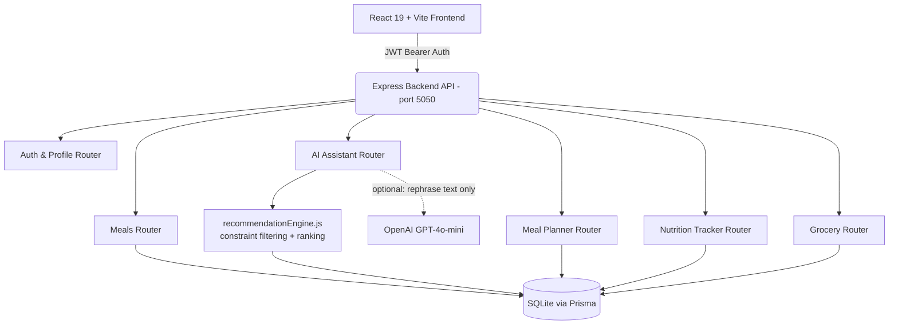

# Meal Finder AI

[](https://react.dev/)
[](https://vitejs.dev/)
[](https://nodejs.org/)
[](https://expressjs.com/)
[](https://www.prisma.io/)
[](https://www.sqlite.org/)
[](https://tailwindcss.com/)

A full-stack nutrition and meal-planning app: a 110-recipe database, a **deterministic** (non-LLM) recommendation engine that enforces hard nutritional and dietary constraints instead of trusting an AI model to get them right, a 7-day meal planner, daily macro/hydration tracking against personalized TDEE targets, and a grocery list auto-generated from the planned week.

An optional OpenAI key can be added to rephrase the engine's already-computed recommendation in a more conversational tone — the app is fully functional, and every number it shows is database-verified, without that key.

---

## Key Features

### 1. Deterministic AI Nutrition Copilot (`/ai`)
- **Multi-constraint parsing**: extracts calorie ceilings, protein floors, meal slot, diet, cuisine, prep time, and allergens from a natural-language prompt, and always layers in the user's persistent profile (allergies, dislikes, diet) even when the prompt doesn't mention them.
- **Hard constraints, not suggestions**: allergens and diet restrictions are filtered *before* any ranking happens — a result can never violate them, even under fallback relaxation (which only ever loosens cuisine/calorie/protein *closeness*, never diet or allergens).
- **Protein-density ranking**: candidates are scored primarily on protein-per-100kcal so a low-calorie/high-protein request can't surface a high-calorie dish.
- **Every number comes from the database.** The AI layer (when an OpenAI key is configured) only rephrases the headline/reason text for an already-selected meal — it cannot invent a recipe, a calorie count, or a macro.
- **Cook With What I Have**: matches pantry ingredients against the recipe database with a percentage score and pushes missing ingredients to the grocery list in one click.

### 2. Recipe Catalog (`/meals`)
- 110 recipes spanning 10 cuisines (Indian, Mediterranean, Italian, Mexican, American, Middle Eastern, Japanese, Korean, Thai, Asian Fusion), each with full macros, ingredients, and step-by-step instructions.
- Serving-size scaler that recalculates macros and ingredient quantities live.
- Sort by calories, protein density, or prep time; search and meal-slot filtering.

### 3. Weekly Meal Planner (`/planner`)
- A 7-day × 4-slot grid. Smart Swap suggests macro-comparable alternatives for any planned meal. Duplicate a day's plan to another day; mark meals eaten to log them automatically.

### 4. Nutrition Tracker & Analytics (`/tracker`)
- Daily calorie/protein/carb/fat progress against Mifflin-St Jeor-derived targets, hydration logging, and a 7-day trend view.

### 5. Grocery List (`/grocery`)
- Auto-consolidated from every meal in the current week's plan, grouped by category, with a shopping checklist.

---

## Architecture



The AI Assistant chat and the Dashboard's unprompted "what's next" suggestion both go through the same `recommendationEngine.js` — constraint extraction, hard filtering, and fallback relaxation are shared, so a bug fixed in one path can't silently persist in the other. Only the final ranking strategy differs by design: the assistant ranks by relevance to the prompt, the dashboard ranks by closeness to the user's remaining calorie/protein budget.

---

## Quick Start

### 1. Prerequisites
- Node.js v18+ and npm v9+

### 2. Install

This repo has **two independent npm projects** — the root (frontend) and `backend/` — each with its own `package.json` and `node_modules`. Install both:

```bash
git clone https://github.com/Mohiarya/Meal-finder-project.git
cd Meal-finder-project

npm install
cd backend && npm install && cd ..
```

### 3. Configure environment variables

Copy the two `.env.example` files and fill them in:

```bash
cp .env.example .env
cp backend/.env.example backend/.env
```

`backend/.env` needs a real `JWT_SECRET` — the server refuses to start without one. Generate one with:

```bash
node -e "console.log(require('crypto').randomBytes(48).toString('hex'))"
```

`OPENAI_API_KEY` is optional (see [AI Configuration](#ai-configuration)). The frontend's `.env` (`VITE_API_URL`) can stay empty for local development — it falls back to `http://localhost:5050/api`.

### 4. Initialize and seed the database

```bash
npm run seed
```

This creates `backend/prisma/dev.db`, seeds the 110 recipes, and creates a demo account (see below).

### 5. Run it

In two terminals:

```bash
# Terminal 1 — backend API on port 5050
npm run server

# Terminal 2 — frontend on port 5173
npm run dev
```

Open **http://localhost:5173**. (If you run the frontend on a different port, add it to `backend/app.js`'s CORS allowlist or set `CLIENT_ORIGIN` in `backend/.env`.)

### 6. Run the tests

```bash
npm run test              # frontend — Vitest
cd backend && npm run test  # backend — node:test
```

---

## Demo Account

```
Email:    demo@mealfinder.com
Password: demo12345
```

Seeded with a sample profile, macro targets, and weekly plan so the app is immediately explorable without registering. The login page also has a one-click "Demo Login" button.

---

## AI Configuration

`OPENAI_API_KEY` in `backend/.env` is optional. Without it, the AI Assistant still works end-to-end — headline and reason text are generated deterministically from the same data the recommendation is built from. With a key set, that text is passed through GPT-4o-mini to be rephrased more conversationally; the model receives the already-selected meal's real data and is not permitted to change the calories, macros, or ingredients, and its output is validated (length and shape) before being shown — a malformed or empty AI response silently falls back to the deterministic text rather than breaking the page.

---

## Testing

- **Backend** (`backend/*.test.js`, run via `node --test`): unit tests for the recommendation engine's constraint extraction, hard-constraint filtering, fallback relaxation, and ranking; unit tests for the nutrition-target calculator (BMR/TDEE/macro-split math, including edge cases like the weight-loss calorie floor and malformed profile input); integration tests against the real Express app covering auth, and — the most security-relevant tests in the suite — that one user genuinely cannot read, modify, or delete another user's meal plans, tracker logs, favorites, or grocery items (verified both by HTTP status and by querying the database directly afterward).
- **Frontend** (`src/**/*.test.jsx`, run via Vitest): covers `ProtectedRoute`'s auth-gating behavior (loading state, redirect when logged out, render when logged in).

Coverage is intentionally scoped to logic where a bug would be silent and high-impact (constraint violations, cross-user data access, macro math) rather than chasing a coverage percentage.

---

## Security Notes

- Passwords are hashed with bcrypt; sessions are JWTs sent as a `Bearer` token (not cookies).
- Every meal-plan/tracker/favorite/grocery mutation verifies the resource belongs to the authenticated user before touching it, rather than trusting a client-supplied ID.
- CORS is an explicit allowlist (`localhost:3002`, `localhost:5173`, and `CLIENT_ORIGIN` in production) — not `origin: "*"` — since the JWT is bearer-token-based and an open CORS policy would let any origin holding a copy of a token replay it.
- Auth and AI endpoints are rate-limited (20 requests / 10 minutes) against brute-force and cost abuse.
- Unhandled server errors return a generic message; only CORS rejections get a specific one. Internal error details are never sent to the client.

---

## Known Limitations

Being direct about what this project is and isn't, per the philosophy above:

- **Recipe photography**: 110 recipes draw from 38 unique Unsplash images, so most photos are shared across more than one recipe. Three recipes that had a genuinely mismatched or dead image were fixed and manually verified; the remaining sharing is a real gap that would need either commissioned/licensed photography or a larger stock-photo budget to close properly, not a quick fix.
- **In-memory filtering**: the recommendation engine and meal query endpoints filter/sort the recipe set in application memory rather than in SQL. At 110 recipes this is fast and simpler to reason about; it is not the approach that would be chosen for a catalog in the tens of thousands, but rewriting the filtering into SQL now would be premature for the current data size.
- **SQLite on disk**: fine for local development and for platforms with a persistent disk (e.g. a Render/Fly.io volume, or a VM). If you deploy to a platform with an ephemeral filesystem (e.g. Vercel serverless functions, most PaaS "free tier" containers), the SQLite file will not persist across deploys or restarts — you'd want to point `DATABASE_URL` at a hosted Postgres/MySQL instance and swap Prisma's provider instead of trying to keep file-based SQLite there.
- **No password reset / email verification flow** — registration and login work, but there's no email delivery integration.

---

## Key API Endpoints

| Method | Endpoint | Description |
|---|---|---|
| `POST` | `/api/auth/register` / `/api/auth/login` | Create an account / authenticate, receive a JWT |
| `GET` | `/api/meals` | Query recipes (`cuisine`, `mealType`, `maxCalories`, `minProtein`, `sortBy`) |
| `POST` | `/api/ai/assistant` | Natural-language multi-constraint recommendation |
| `POST` | `/api/ai/cook-with-ingredients` | Rank recipes by pantry ingredient match |
| `GET` | `/api/ai/quick-copilot-recommendation` | Dashboard's next-meal suggestion based on remaining daily budget |
| `GET` | `/api/meal-plans/current` | The active 7-day plan |
| `PUT` | `/api/meal-plans/swap-meal` | Replace a planned meal with a macro-comparable alternative |
| `GET` | `/api/tracker/today` | Today's consumed-vs-target macros |
| `GET` | `/api/grocery` | This week's consolidated grocery checklist |

---

## Project Structure

```text
meal-finder/
├── backend/
│   ├── config/              # Prisma client, JWT secret loading
│   ├── middleware/          # auth (required + optional), rate limiters
│   ├── services/
│   │   └── recommendationEngine.js  # shared constraint filtering + ranking
│   ├── prisma/
│   │   ├── recipes/         # modular 110-recipe dataset
│   │   ├── schema.prisma
│   │   └── seed.js
│   ├── routes/               # ai, auth, meals, mealPlans, tracker, grocery, favorites, profile
│   ├── scripts/
│   │   └── validateRecipes.js  # data-quality checks (`npm run validate-recipes`)
│   ├── app.js                # Express app (routes, CORS, error handling)
│   └── server.js             # entrypoint — loads env, starts the server
├── src/
│   ├── api.js                # frontend API client (JWT header injection)
│   ├── components/           # MealCard, MealModal, MealSwapModal, ProtectedRoute, ...
│   ├── context/               # AuthContext
│   ├── pages/                 # Dashboard, MealFinder, AI Assistant, Planner, Tracker, ...
│   ├── utils/
│   │   └── imageFallback.js  # shared  fallback
│   └── App.jsx
├── .env.example
├── backend/.env.example
└── package.json
```

---

## License

MIT.
